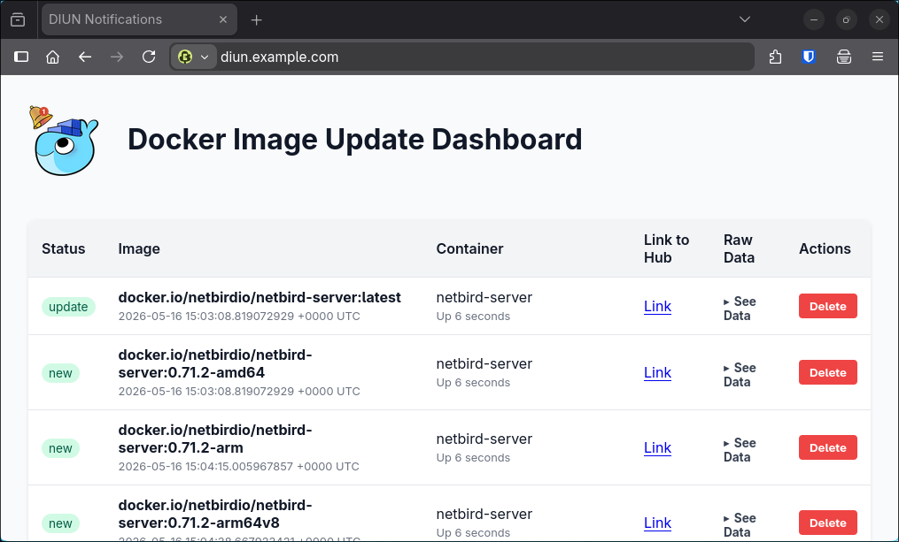

# DIUN-Web

CAUTION. This repository is not maintained. It just shares the vibe-coded stuff with the world
without any guarantee by the author. View the project status as 'end-of-life'.

This is a simple vibe-coded web interface that displays your DIUN (Docker Image Update Notifier)
notifications.
The notifications received are stored in a simple JSON file, which is parsed each time
the web server receives an HTTP request.

The app provides no authentication and no https. Both is recommended via use of 
a reverse proxy.



## How to install

This assumes that you run DIUN in docker via docker compose. If this is not the case,
you have to figure out yourself what to do.

To configure DIUN to push its notifications into DIUN-Web, you need to inject the
`diun_notify.py` file from this repository into the docker container of DIUN
and install python.

Moreover, both DIUN and DIUN-Web need to share a volume to exchange the current notifications.

A full `docker-compose.yaml` could look like this, when traefik is used
to terminate tls and handle authentication via a middleware:

```
services:
  diun:
    image: crazymax/diun:latest
    container_name: diun
    restart: unless-stopped
    volumes:
      - "./diun.yaml:/etc/diun/diun.yaml"
      - "./data:/data"
      - "./diun_notify.py:/app/bin/diun_notify.py"
      - "./notification_data:/app/data"
      - "/var/run/docker.sock:/var/run/docker.sock"
    environment:
      - TZ=Europe/Paris
      - LOG_LEVEL=info
      - LOG_JSON=false
    entrypoint: sh -c "apk add python3 && diun serve"
  diun-web:
    image: jonasbernard/diun-web
    restart: unless-stopped
    volumes:
      - "./notification_data:/app/data"
    labels:
      - traefik.enable=true
      - traefik.http.routers.diunweb.rule=Host(`diun.example.com`)
      - traefik.http.routers.diunweb.middlewares=authentik@file
    networks:
      - traefik

networks:
  traefik:
    external: true
```

To configure DIUN to push to the web interface, use the following configuration:

```
# ... more configuration
notif:
  script:
    cmd: "python"
    args:
      - "/app/bin/diun_notify.py"
      - "/app/data/notifications.json"
  mail:
    # more configuration...
```

